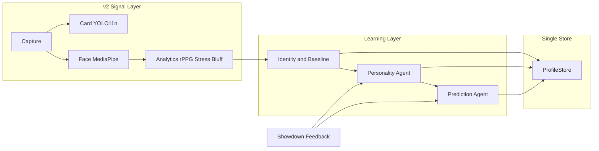

# Multi-Agent Opponent Learning (Revised)

## Relationship to the v2 Pipeline Plan

The v2 plan defines the **real-time signal layer**: async capture, YOLO11n TensorRT + MediaPipe, CHROM rPPG, blendshape-based AUs, and a **baseline-relative z-score anomaly** bluff signal (HR, AU, blink, action timing, stress trend). That layer is optimized for sub-100ms latency and produces a traffic-light indicator (green/yellow/red) plus dominant signal.

**This plan defines the learning layer on top of it:**

- **v2 pipeline** = real-time signal layer (what you see this hand).
- **This plan** = identity (face memory) + personality inference + prediction that **updates at showdown** so the system gets dramatically more useful by session 3–4 (e.g. "this person bluffed 3 out of 4 times when showing elevated stress on the river").

The two are one architecture: the pipeline produces context-adjusted signals; the learning layer consumes them, persists per-opponent state, and updates from showdown outcomes. There is **no parallel opponent system**: the v2 pipeline writes into the same ProfileStore this layer uses.

---

## Single Source of Truth: ProfileStore + FaceEmbedder

**Per-opponent** means exactly: the ProfileStore record for whichever face embedding the system matched.

- **Identity**: [FaceEmbedder](c:\Users\Student\Desktop\Gitty2\Stoned\adaptive_learning\face_embedder.py) + [ProfileStore.find_or_create_player(embedding)](c:\Users\Student\Desktop\Gitty2\Stoned\adaptive_learning\profile_store.py) remain the single source of truth. No duplicate "opponent_profile" store.
- **v2 pipeline** (when built) writes into ProfileStore (or the same DB):
  - Baselines (resting HR, default AUs, blink rate, behavioral tempo).
  - Z-score history / running stats if needed for context adjustment.
  - Showdown outcomes (was_bluffing, context at decision time).
- **This learning layer** reads and writes: baseline (optional sync with v2), personality state, and predictor state (bandit/RL). All keyed by `player_id` from face match.

So: one store, one identity mechanism, v2 and the learning layer both use it.

---

## Pipeline Replacement: unified_ar_system → poker_ar_unified

**poker_ar_unified/** is a rewrite that **replaces** [unified_ar_system.py](c:\Users\Student\Desktop\Gitty2\Stoned\unified_ar_system.py), not a parallel system.

- **Phases 1–2 (v2)**: Build poker_ar_unified (threads, YOLO11n, MediaPipe, CHROM, blendshape AUs, analytics/stress_detector, bluff_estimator). The new [analytics/stress_detector](c:\Users\Student\Desktop\Gitty2\Stoned\micro_expressions\stress_detector.py) **replaces** micro_expressions/stress_detector; the old module is **retired** after Phase 2 validation confirms parity.
- **Phase 3**: Migration of context-switching and gesture hooks from unified_ar_system into poker_ar_unified, then **unified_ar_system.py is deprecated**. The learning layer (this plan) plugs into the active pipeline—first via fixed unified_ar_system (interim), then via poker_ar_unified once it is the entry point.

---

## Context-Adjusted Z-Scores (Bluff Formula Inputs)

The v2 bluff formula uses z-scores (hr_z_score, au_stress_z_score, blink_rate_z_score, action_timing_z_score, stress_trend_score). **Context normalization happens before z-scoring.**

- **Idea**: Raw HR deviation from personal baseline is confounded by context (e.g. everyone’s HR rises on river bets). So the **expected** delta for this context (pot size, street, action type) is estimated (e.g. from session averages or a small regression), and the **z-score** measures deviation from that **context-adjusted expectation**.
- **Concretely**: e.g. "expected HR delta on river with large pot = +5 BPM"; observed delta = +12 BPM → the anomaly is +7 BPM relative to that expectation, then z-scored using per-opponent variance. Same for AU, blink, timing.
- **Formula**: The same weighted sum of z-scores (0.25 hr + 0.25 au + 0.20 blink + 0.15 timing + 0.15 trend) is used; **inputs** to that formula are context-adjusted (deviation from context-specific expectation). The learning layer receives (or computes) these adjusted deviations so personality and predictor see the same clean signal.

---

## Target Architecture: Multi-Agent Learning Layer

Flow: **v2 signal layer** (context-adjusted z-scores, traffic light) → **Identity** → **Personality** → **Predictor** → **Showdown** → update Personality + Predictor; all state in ProfileStore keyed by matched face.

---

## Component Design

### 1. Identity and Baseline Agent (refactor existing)

- **Role**: Recognize opponent by face; maintain per-opponent physiological baseline; expose context-adjusted deviation for this frame.
- **Inputs**: Face landmarks (from v2 face analyzer), HR, stress, AUs, optional poker context (pot size, street) for context adjustment.
- **Outputs**: `player_id`, baseline dict, **context-adjusted** deviation (e.g. hr_delta_adj, stress_delta_adj, au_delta_adj) for the learning layer.
- **Reuse**: [FaceEmbedder](c:\Users\Student\Desktop\Gitty2\Stoned\adaptive_learning\face_embedder.py), [BaselineExtractor](c:\Users\Student\Desktop\Gitty2\Stoned\adaptive_learning\baseline_extractor.py), [ProfileStore](c:\Users\Student\Desktop\Gitty2\Stoned\adaptive_learning\profile_store.py). v2 pipeline writes baselines into ProfileStore (or Identity reads from the same store v2 writes to).
- **Change**: Clear interface `step(landmarks, hr, stress, au, context?) -> (player_id, deviation_adj, baseline_ready)`. Single-opponent: one active `player_id` from face match.

### 2. Personality Inference Agent (new)

- **Role**: Maintain a persistent personality for the single opponent from all past showdowns and physiology; condition prediction on it.
- **State**: Bluff base rate, stress–bluff correlation, HR–bluff correlation, consistency (inverse variance across contexts). Stored per `player_id` in ProfileStore.
- **Update**: After each showdown, update these stats (running averages, incremental regression, or Bayesian update). No heavy ML; online, sample-efficient.
- **Output**: Personality state (dict/vector) to Prediction Agent; optional UI string ("bluffs more under stress", "fairly consistent").
- **Persistence**: ProfileStore (new table or JSON column). Load when same face is recognized.

### 3. Prediction RL Agent (upgrade from bandit)

- **Role**: Given context-adjusted deviation, personality state, optional hand/equity bucket, output P(bluff) and BLUFF/STRONG with confidence; improve with experience.
- **State**: Physio buckets (from context-adjusted deviation), personality bucket or vector, optional hand-strength bucket.
- **Reward**: At showdown: +1 correct, −1 wrong.
- **Algorithm**: Personality-conditioned contextual bandit (Thompson Sampling) or tabular Q-learning over (physio_bucket, personality_bucket). Persist in ProfileStore per player.

### 4. Coordination and Data Flow

- **Single opponent**: One active `player_id` from face match; load baseline, personality, predictor from ProfileStore; on face lost, keep last state.
- **Per frame**: Identity step → (if no baseline, calibration only) → Personality get_state → Predictor predict → render (traffic light + learning-layer overlay: e.g. "Learned: likely bluff 72%").
- **On showdown**: Personality update(player_id, deviation_adj, was_bluffing); Predictor update(player_id, state_at_decision, action, reward); persist both to ProfileStore.

---

## Implementation Order (Aligned with v2)

1. **Interim: fix unified_ar_system integration**
  Correct shared_state keys (landmarks, heart_rate_bpm, stress_score) so the current pipeline feeds the learning layer. Unblocks face memory and physiology until poker_ar_unified exists.
2. **Add Personality Inference Agent**
  New [adaptive_learning/personality_model.py](c:\Users\Student\Desktop\Gitty2\Stoned\adaptive_learning\personality_model.py): bluff base rate, stress–bluff and HR–bluff correlations, consistency; update at showdown; persist in ProfileStore.
3. **Extend ProfileStore**
  Add personality_state (and predictor state if not reusing existing bandit table). Single DB for v2 baselines + learning state.
4. **Refactor AdaptiveLearningSystem into agent pipeline**
  Orchestrate Identity, Personality, Prediction; single-opponent; read/write ProfileStore only. Works with current unified_ar_system, then with poker_ar_unified once Phase 3 migrates entry point and gestures.
5. **Upgrade OpponentModel to Prediction RL Agent**
  State includes context-adjusted deviation buckets + personality; Thompson Sampling or tabular Q; persist per player in ProfileStore.
6. **v2: context-adjusted deviations**
  When v2 bluff_estimator is implemented, ensure it (or the learning layer) computes expected deltas per context (pot, street) and z-scores from those. Learning layer consumes the same context-adjusted inputs.
7. **Phase 3: plug learning layer into poker_ar_unified**
  When unified_ar_system is replaced by poker_ar_unified, wire the same learning API (identity step, personality get, prediction, showdown update) into the v2 analytics/render path; keep using ProfileStore and FaceEmbedder as single source of truth.

---

## File-Level Summary

| Area              | Action                                                                                                                                                                                                                                                                              |
| ----------------- | ----------------------------------------------------------------------------------------------------------------------------------------------------------------------------------------------------------------------------------------------------------------------------------- |
| **Single store**  | [ProfileStore](c:\Users\Student\Desktop\Gitty2\Stoned\adaptive_learning\profile_store.py): add personality_state (and predictor state if needed). v2 pipeline writes baselines and showdowns here; no separate opponent_profile.                                                    |
| **Identity**      | [FaceEmbedder](c:\Users\Student\Desktop\Gitty2\Stoned\adaptive_learning\face_embedder.py) + ProfileStore; [BaselineExtractor](c:\Users\Student\Desktop\Gitty2\Stoned\adaptive_learning\baseline_extractor.py) refactored for clear step() and context-adjusted deviation if needed. |
| **Personality**   | New [adaptive_learning/personality_model.py](c:\Users\Student\Desktop\Gitty2\Stoned\adaptive_learning\personality_model.py): get_state, update at showdown, persist via ProfileStore.                                                                                               |
| **Prediction**    | [adaptive_learning/opponent_model.py](c:\Users\Student\Desktop\Gitty2\Stoned\adaptive_learning\opponent_model.py): extend state with personality and optional hand bucket; persist per player.                                                                                      |
| **Orchestration** | [adaptive_learning/adaptive_learning_system.py](c:\Users\Student\Desktop\Gitty2\Stoned\adaptive_learning\adaptive_learning_system.py): identity → personality → prediction; showdown updates both; works with unified_ar_system now, poker_ar_unified after Phase 3.                |
| **Stress**        | v2 [analytics/stress_detector](c:\Users\Student\Desktop\Gitty2\Stoned\micro_expressions\stress_detector.py) replaces micro_expressions version; retire old after Phase 2 parity. Learning layer consumes stress/bluff signal from active pipeline.                                  |
| **Entry point**   | [unified_ar_system.py](c:\Users\Student\Desktop\Gitty2\Stoned\unified_ar_system.py) interim (with key fixes); [poker_ar_unified/main.py](c:\Users\Student\Desktop\Gitty2\Stoned\poker_ar_unified\main.py) replaces it in Phase 3; context-switch and gesture hooks migrated then.   |

---

## Design Choices to Confirm

- **RL vs bandit**: Start with personality-conditioned Thompson Sampling; move to tabular Q-learning if you want explicit value-based RL and exploration.
- **Poker context**: Add hand/equity bucket as optional state dimension (default "unknown") when v2 provides it.
- **Personality traits**: Start with 3–4 (bluff base rate, stress–bluff, HR–bluff, consistency); add more later if needed.

This plan makes the learning layer the **identity + personality + prediction** stack on top of the v2 signal layer, with one ProfileStore and one face-based identity, context-adjusted inputs, and a clear migration path from unified_ar_system to poker_ar_unified.