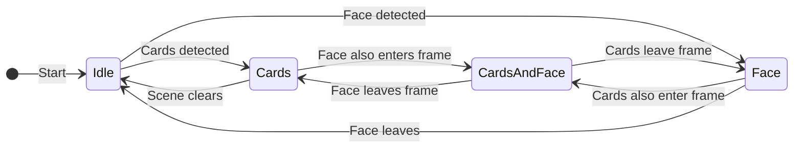
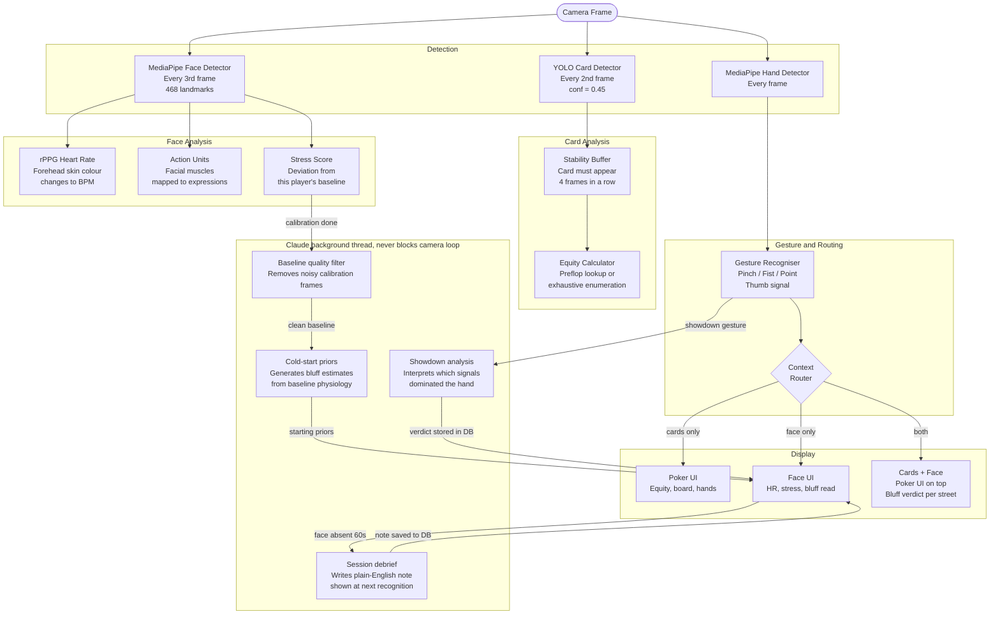
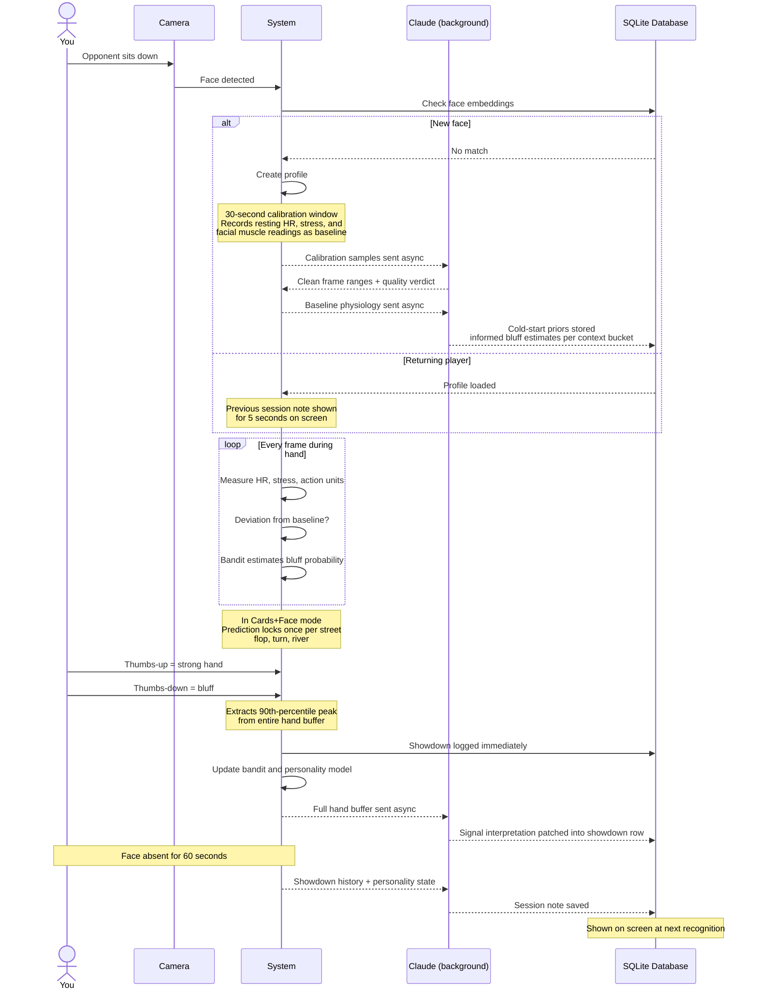

# Stoned - AR Poker Analysis System

Point a webcam at playing cards and get instant poker odds. Point it at an opponent's face and the system quietly tracks their heart rate, stress level, and facial muscle movements, building a personal bluff-detection model that gets sharper every time you record a showdown.

No keyboard needed. Everything is controlled by hand gestures.

---

## Table of Contents

- [What It Does](#what-it-does)
- [How It Knows What to Show](#how-it-knows-what-to-show)
- [The Full Pipeline](#the-full-pipeline)
- [How the Bluff Detection Learns](#how-the-bluff-detection-learns)
- [Claude Integration](#claude-integration)
- [Configuration](#configuration)
- [Hand Gesture Reference](#hand-gesture-reference)
- [Directory Structure](#directory-structure)
- [Installation](#installation)
- [Required Files Not in the Repository](#required-files-not-in-the-repository)
- [Training Your Own Card Detection Model](#training-your-own-card-detection-model)
- [Running the System](#running-the-system)

---

## What It Does

The system watches the camera continuously and automatically switches between three modes depending on what it sees:

| Mode | What triggers it | What appears on screen |
|------|-----------------|------------------------|
| **Cards** | Playing cards in view | Detection boxes on each card, your win percentage, best hand combinations |
| **Face** | Opponent's face in view | Live heart rate, stress meter, facial muscle readings, bluff prediction |
| **Cards + Face** | Both in the same frame | Full poker UI, face analysis runs in background, bluff verdict locked per street |

Switching requires 8 consecutive frames showing the new scene (~0.25 seconds), so a hand waving past does not trigger a mode change.

---

## How It Knows What to Show



The bottom-right corner always shows a small pill label: **IDLE / CARDS / FACE / FACE+HAND / CARDS+FACE**. A thin bar at the top fills while a pending context switch counts its confirmation frames.

---

## The Full Pipeline

Every frame is processed by three parallel detectors, then routed to the right display:



---

## How the Bluff Detection Learns

The system builds a private profile for each opponent it sees. Here is the full cycle from first sighting to a confident prediction:



> **First 8 showdowns:** The panel shows a heuristic estimate based on raw signal deviation, labelled "SIGNAL".
> **After 8+ showdowns:** The panel switches to the learned model, labelled with the observation count.

### Per-Street Locking (Cards + Face mode)

When both cards and a face are visible, the bluff verdict is not shown as a live fluctuating bar. Instead, a single prediction fires once each time a new community card is revealed (flop, turn, river) and stays fixed until the next street. This prevents the display from flipping back and forth mid-hand.

---

## Claude Integration

Claude is used in four places, all as background threads. The camera loop is never blocked.

| When it fires | What Claude does |
|---------------|-----------------|
| After calibration window closes | Reviews the raw signal time series, identifies frames where the player was talking or moving, returns the clean segments only. The baseline is rebuilt from clean frames. |
| When a new player profile is created | Reads the baseline physiology and generates starting bluff probability estimates for each context bucket. Gives the bandit an informed starting point before any showdowns exist. |
| After a showdown gesture | Analyses the full hand signal buffer, interprets which physiological signals dominated, and stores a structured verdict alongside the showdown record. Runs in a background thread; the showdown is logged immediately. |
| When the opponent's face has been absent for 60 seconds | Reads all showdown history, personality state, and bandit context for that player. Writes a plain-English paragraph describing their patterns. Shown on screen the next time the player is recognised. |

Claude is accessed via the Claude Code CLI using your existing `claude.ai` subscription. No API key or separate billing is needed. The binary path is set in `.env`.

All data sent is numeric only: AU intensities, heart rate values, stress scores, and showdown statistics. No images or face embeddings leave the device.

---

## Configuration

Two files control runtime behaviour.

### `.env` - personal and environment-specific values

Copy `.env` and fill in your path. This file is gitignored.

```
CLAUDE_EXE=C:\Users\YourName\.local\bin\claude.exe
CLAUDE_CLI_MODEL=haiku
CLAUDE_TIMEOUT=45
PROFILES_DB_PATH=adaptive_learning/profiles.db
CAMERA_INDEX=0
```

`CLAUDE_CLI_MODEL` accepts `haiku`, `sonnet`, or `opus`. Haiku is the default because it is fast enough for background analysis and does not interrupt the session.

### `config.py` - tunable algorithm parameters

This file is committed and safe to edit. The values most likely to need adjustment:

| Parameter | Default | Effect |
|-----------|---------|--------|
| `YOLO_CONF` | 0.45 | Raise to reduce false card detections. Lower to catch partially visible cards. |
| `CARD_STABILITY_THRESHOLD` | 4 | Frames a card must appear before being shown. Raise if phantom detections appear. |
| `FACE_SIMILARITY_THRESHOLD` | 0.85 | How strictly a face must match to load an existing profile. Lower = more permissive. |
| `CALIBRATION_FRAMES` | 90 | Frames collected for baseline (~3 seconds at 30fps). Raise for a steadier baseline. |
| `NOISY_HR_VAR_THRESHOLD` | 100.0 | HR variance above this disables HR-based updates for that hand. |
| `THUMB_DWELL_SECONDS` | 0.4 | How long to hold a thumbs gesture before it fires. |
| `SHOWDOWN_COOLDOWN_SECONDS` | 3.0 | Minimum gap between two showdown recordings. |
| `MIN_PRED_SAMPLES` | 8 | Showdowns required before switching from heuristic to trained model. |

---

## Hand Gesture Reference

All interaction is gesture-controlled. The only keyboard shortcuts are `q` (quit), `c` (clear board), and `r` (reset panel layout).

### Drag and Drop Panels

Every panel has a small circle at its top-centre. Point your index finger at it and hold still for 0.5 seconds to grab it, then move your hand to reposition. Curl your finger to drop.


### All Gesture Actions

**Works in every mode:**

| Gesture | What it does |
|---------|-------------|
| Index finger pointing at panel handle, hold 0.5s | Grab and drag that panel |
| Curl index finger | Drop panel (position saved automatically) |
| Right fist, hold 3 seconds | Wipe this opponent's learned profile |
| Both fists together, hold 5 seconds | Wipe all profiles from the database |

**Face / stress mode only:**

| Gesture | What it does |
|---------|-------------|
| Thumbs-up, hold 0.4s | Record this hand as STRONG HAND |
| Thumbs-down, hold 0.4s | Record this hand as BLUFF |
| Left pinch | Raise face analysis panel level |
| Right pinch | Open heart-rate detail panel |

**Cards mode only:**

| Gesture | What it does |
|---------|-------------|
| Left pinch, hold until locked | Save the visible cards as your hole cards |
| Right pinch, hold 5 seconds | Lock the visible cards as board cards |
| Two-finger scroll (right hand) | Scroll through winning hand combinations |

**Cards + Face mode:** Uses the cards gestures. Face panels are hidden but analysis continues. A compact bluff verdict panel appears top-right and updates once per street.

---

## Directory Structure

```
Stoned/
|
|-- unified_ar_system.py        Main entry point. Runs the camera loop,
|                                detects context, routes to the right display,
|                                and wires all three modules together.
|
|-- config.py                   Tunable algorithm parameters (committed).
|-- .env                        Personal paths and secrets (gitignored).
|-- MODULES.md                  Technical explanation of each module,
|                                why each approach was chosen, and alternatives.
|-- face_landmarker.task        MediaPipe face model (3.6 MB).
|-- hand_landmarker.task        MediaPipe hand model (7.5 MB).
|-- requirements.txt            Python package list.
|
|-- adaptive_learning/          Learns each opponent's bluffing patterns.
|   |-- adaptive_learning_system.py   Main class (the only file called externally).
|   |-- face_embedder.py        Recognises which opponent is on screen.
|   |-- baseline_extractor.py   Records their resting physiological state.
|   |-- claude_advisor.py       Claude CLI integration for all four analysis calls.
|   |-- opponent_model.py       Predicts bluff probability (Thompson Sampling bandit).
|   |-- personality_model.py    Tracks bluff base rate and stress correlation per player.
|   |-- prior_generator.py      Fallback first-guess parameters before any showdowns.
|   |-- profile_store.py        All SQLite reads and writes.
|   |-- panel_positions.py      Remembers where you moved each panel.
|   |-- profiles.db             The database (auto-created on first run).
|   `-- README.md               Detailed docs for this module.
|
|-- micro_expressions/          Reads physiological signals from the face.
|   |-- engine.py               Pipeline coordinator.
|   |-- face_detection.py       Finds the face, extracts 468 landmarks.
|   |-- rppg_heart_rate.py      Estimates heart rate from forehead skin colour (rPPG).
|   |-- facs_action_units.py    Measures facial muscle intensities from landmark geometry.
|   |-- stress_detector.py      Combines signals into a 0-100 stress score.
|   |-- stress_classifier.py    Labels: Calm / Mild / Moderate / High / Extreme.
|   |-- ar_ui_controller.py     Draws all face-mode AR panels on screen.
|   |-- hand_gesture_detector.py  Gesture detector for standalone mode.
|   |-- video_processor.py      Batch-analyse a recorded video file.
|   |-- heart_rate_validator.py Check rPPG accuracy against a reference.
|   |-- stress_analytics.py     Generate offline charts and reports.
|   |-- main.py                 Standalone entry point (no poker).
|   `-- README.md               Detailed docs for this module.
|
`-- poker_hand/                 Detects cards and calculates poker odds.
    |-- poker_main.py           Standalone entry point and equity calculation functions.
    |-- poker_ar_ui.py          Draws equity panel, board, and winning hands.
    |-- poker_engine_unified.py YOLO wrapper with card stability logic.
    |-- hand_gesture_detector.py  Full gesture detector (pinch, fist, thumb, point).
    |-- simple_card_detector.py Minimal card detector for model testing.
    |-- preflop_equity.csv      Win % for all 169 starting hand types.
    |-- poker_v1.pt             Trained YOLO model. 52 card classes.
    `-- README.md               Detailed docs for this module.
```

---

## Installation

```bash
# 1. Create a virtual environment
python -m venv .venv

# 2. Activate it
.venv\Scripts\activate        # Windows
source .venv/bin/activate     # macOS / Linux

# 3. Install dependencies
pip install -r requirements.txt
```

Core packages: `opencv-python`, `mediapipe`, `ultralytics` (YOLO), `treys` (poker evaluator), `numpy`, `python-dotenv`.

`torch` is optional, only needed for local SLM-based cold-start priors which are disabled by default.

---

## Required Files Not in the Repository

The following files are not committed to git because they are either large binary assets or auto-generated runtime data. You need to obtain or create them before running the system.

### YOLO model weights (`poker_hand/poker_v1.pt`)

This is the custom-trained card detection model. It is not included because model files are large binary assets not suited to version control. See the [Training section](#training-your-own-card-detection-model) below.

Place the downloaded files at:
```
poker_hand/poker_v1.pt
poker_hand/yolo26n.pt
```

### MediaPipe model files (`*.task`)

MediaPipe requires two model files that are also excluded from the repo.

Download them from the MediaPipe Model Hub:
- [face_landmarker.task](https://storage.googleapis.com/mediapipe-models/face_landmarker/face_landmarker/float16/latest/face_landmarker.task)
- [hand_landmarker.task](https://storage.googleapis.com/mediapipe-models/hand_landmarker/hand_landmarker/float16/latest/hand_landmarker.task)

Place copies at all three locations:
```
face_landmarker.task          (root, used by unified_ar_system.py)
micro_expressions/face_landmarker.task
micro_expressions/hand_landmarker.task
poker_hand/face_landmarker.task
poker_hand/hand_landmarker.task
```

### Profiles database (`adaptive_learning/profiles.db`)

This is auto-created on first run. You do not need to do anything. If you want to reset all learned profiles, delete this file and restart.

### Panel positions (`adaptive_learning/panel_positions.json`)

Also auto-created on first run when you drag a panel. Deleting it resets all panels to their default positions.

---

## Training Your Own Card Detection Model

The system uses a YOLOv8 nano model trained on 52 card classes. If you want to retrain it (different card design, different resolution, or to improve accuracy):

**1. Prepare your dataset**

Collect images of all 52 cards in the lighting and background conditions you intend to use. A minimum of 200-300 images per class gives reasonable accuracy. Annotate using [Roboflow](https://roboflow.com) or [LabelImg](https://github.com/HumanSignal/labelImg) in YOLO format.

Structure:
```
dataset/
  images/
    train/
    val/
  labels/
    train/
    val/
  data.yaml
```

**2. Install training dependencies**

```bash
pip install ultralytics
```

**3. Train**

```bash
yolo detect train \
  model=yolov8n.pt \
  data=dataset/data.yaml \
  epochs=50 \
  imgsz=640 \
  name=poker_cards
```

Training output goes to `runs/detect/poker_cards/weights/best.pt`. Copy that file to `poker_hand/poker_v1.pt`.

**4. Evaluate**

```bash
yolo detect val model=runs/detect/poker_cards/weights/best.pt data=dataset/data.yaml
```

The original model was trained with `conf=0.45` and `iou=0.15` at `imgsz=640`. Adjust `YOLO_CONF` and `YOLO_IOU` in `config.py` if your retrained model performs better at different thresholds.

---

### Claude CLI setup

Claude integration uses the Claude Code CLI rather than an API key. If you have Claude Code installed, it will be found automatically. If not, set `CLAUDE_EXE` in `.env` to point to your `claude.exe` binary.

```bash
# Test that the CLI is reachable
claude --version
```

---

## Running the System

```bash
# Unified system (recommended)
python unified_ar_system.py

# Different camera index
python unified_ar_system.py --camera 1

# Poker analysis only (no face)
python poker_hand/poker_main.py

# Stress detection only (no cards)
python micro_expressions/main.py
```

| Key | Action |
|-----|--------|
| `q` | Quit |
| `c` | Clear saved hand and board |
| `r` | Reset all panels to default positions |
| `b` | Force baseline recalibration (face mode) |
