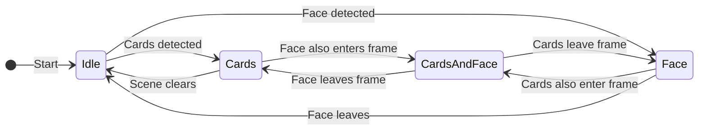
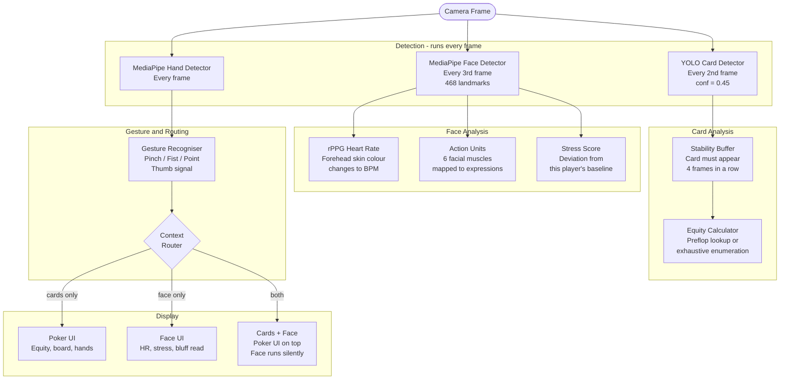
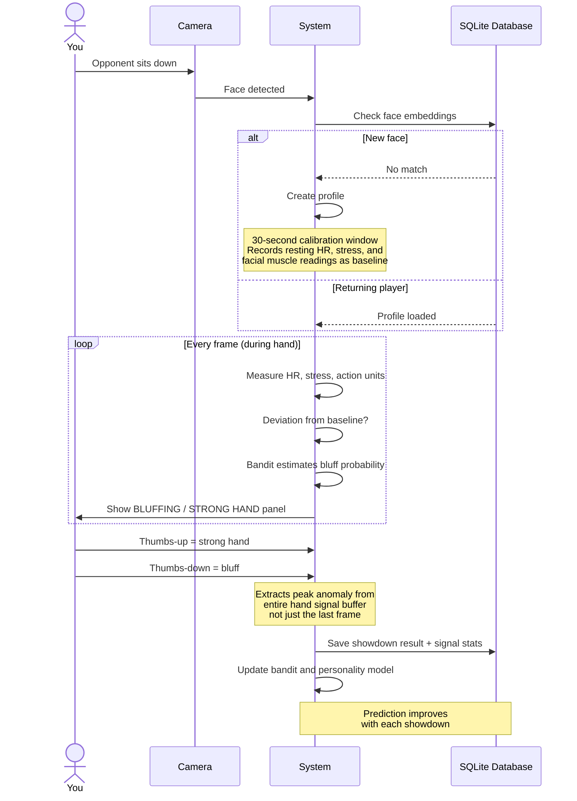
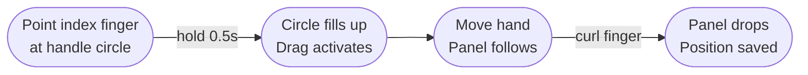

# Stoned - AR Poker Analysis System

Point a webcam at playing cards and get instant poker odds. Point it at an opponent's face and the system quietly tracks their heart rate, stress level, and facial muscle movements, building a personal bluff-detection model that gets sharper every time you record a showdown.

No keyboard needed. Everything is controlled by hand gestures.

---

## Table of Contents

- [What It Does](#what-it-does)
- [How It Knows What to Show](#how-it-knows-what-to-show)
- [The Full Pipeline](#the-full-pipeline)
- [How the Bluff Detection Learns](#how-the-bluff-detection-learns)
- [Hand Gesture Reference](#hand-gesture-reference)
- [Directory Structure](#directory-structure)
- [Installation](#installation)
- [Running the System](#running-the-system)

---

## What It Does

The system watches the camera continuously and automatically switches between three modes depending on what it sees:

| Mode | What triggers it | What appears on screen |
|------|-----------------|------------------------|
| **Cards** | Playing cards in view | Detection boxes on each card, your win percentage, best hand combinations |
| **Face** | Opponent's face in view | Live heart rate, stress meter, facial muscle readings, bluff prediction |
| **Cards + Face** | Both in the same frame | Full poker UI, face analysis runs invisibly in background |

Switching requires 8 frames in a row showing the new scene (~0.25 seconds), so a hand waving past does not trigger a mode change.

---

## How It Knows What to Show



The bottom-right corner of the screen always shows a small pill label: **IDLE / CARDS / FACE / FACE+HAND / CARDS+FACE**. A thin progress bar at the very top fills up while a pending mode switch is counting its 8 confirmation frames.

---

## The Full Pipeline

Every frame from the camera is processed by three parallel detectors, then routed to the right display:



---

## How the Bluff Detection Learns

The system builds a private profile for each opponent it sees. Here is the full cycle from first sighting to a confident prediction:



> **First 2 showdowns:** The panel shows a heuristic estimate based on raw signal deviation.
> **After 2+ showdowns:** The panel switches to the learned model, labelled with the observation count.

---

## Hand Gesture Reference

All interaction is gesture-controlled. The only keyboard shortcuts needed are `q` (quit), `c` (clear board), and `r` (reset panel layout).

### Drag and Drop Panels

Every panel has a small circle at its top-centre. Point your index finger at it and hold still for 0.5 seconds to grab it, then move your hand to reposition. Curl your finger to drop.



### All Gesture Actions

**Works in every mode:**

| Gesture | What it does |
|---------|-------------|
| Index finger pointing at panel handle, hold 0.5s | Grab and drag that panel |
| Curl index finger | Drop panel (position saved automatically) |
| Right fist, hold 3 seconds | Wipe this opponent's learned profile |
| Both fists together, hold 5 seconds | Wipe all profiles from the database |

**Face / stress mode only:**

| Gesture | What it does |
|---------|-------------|
| Thumbs-up, hold 1 second | Record this hand as STRONG HAND |
| Thumbs-down, hold 1 second | Record this hand as BLUFF |
| Left pinch | Raise face analysis panel level |
| Right pinch | Open heart-rate detail panel |

**Cards mode only:**

| Gesture | What it does |
|---------|-------------|
| Left pinch, hold until locked | Save the visible cards as your hole cards |
| Right pinch, hold 5 seconds | Lock the visible cards as board cards |
| Two-finger scroll (right hand) | Scroll through winning hand combinations |

**Cards + Face mode:** Uses the cards gestures. Face panels are hidden but recording continues.

---

## Directory Structure

```
Stoned/
|
|-- unified_ar_system.py        Main entry point. Runs the camera loop,
|                                detects context, routes to the right display,
|                                and wires all three modules together.
|
|-- face_landmarker.task        MediaPipe face model (3.6 MB).
|-- hand_landmarker.task        MediaPipe hand model (7.5 MB).
|-- requirements.txt            Python package list.
|
|-- adaptive_learning/          Learns each opponent's bluffing patterns.
|   |-- README.md               Detailed docs for this module.
|   |-- adaptive_learning_system.py   Main class. The only file the rest
|   |                                  of the codebase calls directly.
|   |-- face_embedder.py        Recognises which opponent is on screen.
|   |-- baseline_extractor.py   Records their resting physiological state.
|   |-- opponent_model.py       Predicts bluff probability (Thompson Sampling).
|   |-- personality_model.py    Tracks bluff base rate, stress correlation.
|   |-- prior_generator.py      First-guess parameters before any data.
|   |-- profile_store.py        Saves everything to SQLite.
|   |-- panel_positions.py      Remembers where you moved each panel.
|   |-- profiles.db             The database (auto-created).
|   `-- panel_positions.json    Saved panel layout (auto-created).
|
|-- micro_expressions/          Reads physiological signals from the face.
|   |-- README.md               Detailed docs for this module.
|   |-- engine.py               Pipeline coordinator. Modules plug in here.
|   |-- face_detection.py       Finds the face, extracts 468 landmarks.
|   |-- rppg_heart_rate.py      Estimates heart rate from skin colour.
|   |-- facs_action_units.py    Measures 6 facial muscle intensities.
|   |-- stress_detector.py      Combines signals into a 0-100 stress score.
|   |-- stress_classifier.py    Labels: Calm / Mild / Moderate / High / Extreme.
|   |-- ar_ui_controller.py     Draws all face-mode AR panels on screen.
|   |-- hand_gesture_detector.py  Gesture detector for standalone mode.
|   |-- video_processor.py      Batch-analyse a recorded video file.
|   |-- heart_rate_validator.py Check rPPG accuracy against a reference.
|   |-- stress_analytics.py     Generate offline charts and reports.
|   |-- main.py                 Standalone entry point (no poker).
|   |-- face_landmarker.task    Model copy for standalone use.
|   `-- hand_landmarker.task    Model copy for standalone use.
|
`-- poker_hand/                 Detects cards and calculates poker odds.
    |-- README.md               Detailed docs for this module.
    |-- poker_main.py           Standalone entry point + equity functions.
    |-- poker_ar_ui.py          Draws equity panel, board, winning hands.
    |-- poker_engine_unified.py YOLO wrapper with card stability logic.
    |-- hand_gesture_detector.py  Full gesture detector (pinch, fist, etc.).
    |-- simple_card_detector.py Minimal card detector for model testing.
    |-- preflop_equity.csv      Win % for all 169 starting hand types.
    |-- df_preflop_hand_distrib.csv  Extended preflop distributions.
    |-- poker_v1.pt             Trained YOLO model. 52 card classes.
    |-- yolo26n.pt              YOLOv8n base weights.
    `-- face_landmarker.task    Model copy for standalone use.
```

---

## Installation

```bash
# 1. Create a virtual environment
python -m venv .venv

# 2. Activate it
.venv\Scripts\activate        # Windows
source .venv/bin/activate     # macOS / Linux

# 3. Install dependencies
pip install -r requirements.txt
```

Core packages installed: `opencv-python`, `mediapipe`, `ultralytics` (YOLO), `treys` (poker evaluator), `numpy`.
`torch` is optional, only needed for LLM-based cold-start priors, which are not used by default.

---

## Running the System

```bash
# Unified system (recommended)
python unified_ar_system.py

# Different camera index
python unified_ar_system.py --camera 1

# Poker analysis only (no face)
python poker_hand/poker_main.py

# Stress detection only (no cards)
python micro_expressions/main.py
```

| Key | Action |
|-----|--------|
| `q` | Quit |
| `c` | Clear saved hand and board |
| `r` | Reset all panels to default positions |
| `b` | Force baseline recalibration (face mode) |
