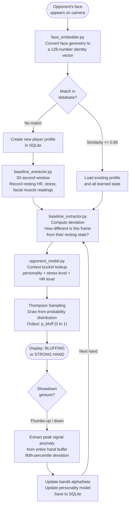
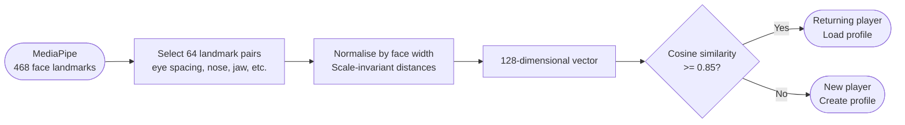
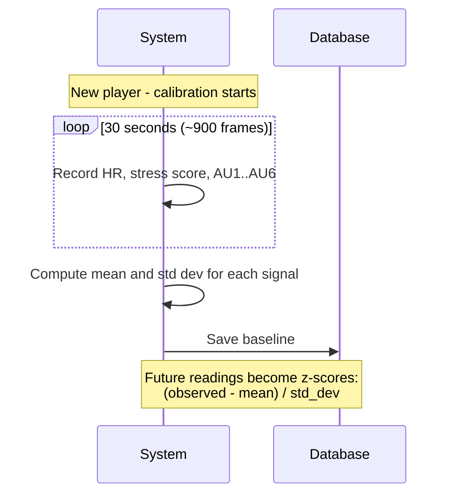
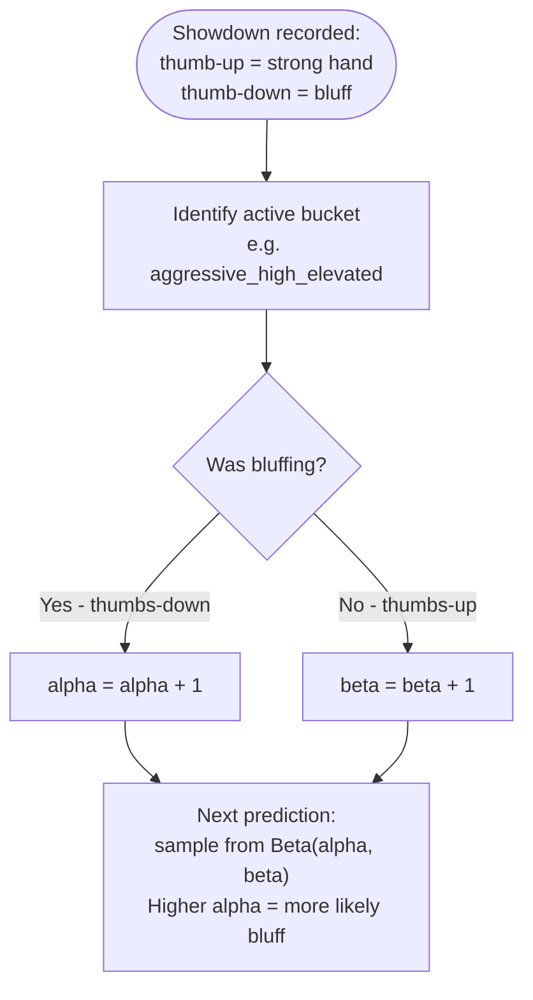
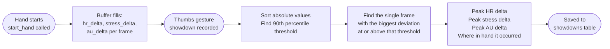
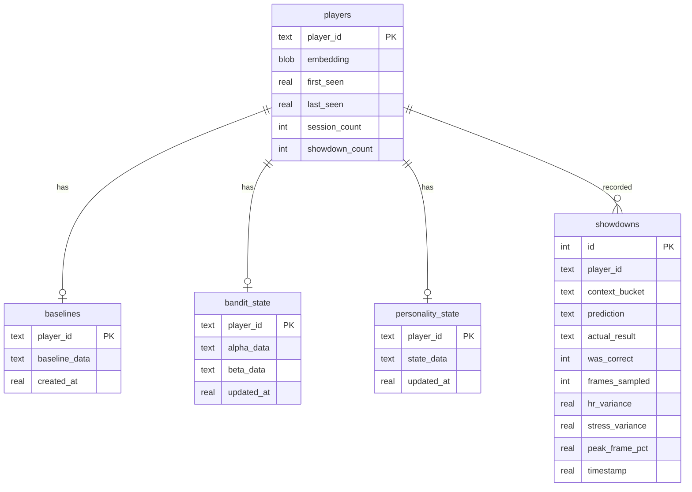

# adaptive_learning - Opponent Profiling and Bluff Detection

This module watches an opponent's face over time and builds a personal model of how they behave when bluffing versus when they have a strong hand. The more showdowns you record with a thumbs gesture, the sharper the prediction becomes.

All data is stored locally in a SQLite database. Nothing leaves the machine.

---

## The Learning Cycle

Here is the full journey from "new opponent sits down" to "confident bluff prediction":

---

## How Player Recognition Works

The system never stores a photo. Instead it measures 64 distances between facial landmark pairs - things like the gap between your eyes relative to your face width, or how your nose width compares to your jaw. These 64 distances form a 128-number vector (each pair gives a horizontal and vertical component).

When a face appears, the system computes cosine similarity against every stored vector. A score of 0.85 or above is considered the same person.

---

## What the Baseline Calibration Does

The stress score and heart rate mean nothing in isolation - a naturally high heart rate is not a tell. The system spends the first 30 seconds with a new player recording their resting state readings. Everything after that is measured as a deviation from that personal baseline.

After calibration, a reading of `hr_delta = +2.1` means the opponent's heart rate is 2.1 standard deviations above their own normal - a meaningful signal regardless of their absolute BPM.

---

## How the Bluff Prediction Works

The prediction engine is a **Thompson Sampling contextual bandit** - a lightweight reinforcement learning approach that maintains uncertainty and explores rather than committing too early.

### Context Buckets

Each prediction is made in a specific context defined by three factors:

| Factor | Possible values |
|--------|----------------|
| Personality type | aggressive, tight, unpredictable, standard |
| Stress state | calm, mild, moderate, high, extreme |
| Heart rate state | normal, elevated, high |

These combine into a bucket name like `aggressive_high_elevated`. Each bucket has its own independent model.

### The Beta Distribution

For each bucket the system maintains two numbers: `alpha` (number of times this bucket was observed and the player was bluffing) and `beta` (times they were not bluffing). The bluff probability is sampled from a Beta(alpha, beta) distribution.

Before any showdowns the system falls back to a heuristic estimate based purely on how much the current signals deviate from baseline. The panel labels this mode "SIGNAL" versus "TRAINED Nobs".

---

## Signal Buffer and Peak Extraction

Rather than capturing physiology only at the moment you make a thumbs gesture, the system buffers every frame's deviation readings from when you started a hand until you show the gesture. At showdown it extracts the **90th-percentile peak** - the most extreme anomaly that appeared at any point during the hand.

This means if a player flinched for two frames in the middle of the hand, that flinch is captured - even if they composed themselves by the time the cards were shown.

---

## Database Schema

---

## Module Reference

| File | Responsibility |
|------|---------------|
| `adaptive_learning_system.py` | The only file the rest of the codebase calls. Orchestrates everything below. |
| `face_embedder.py` | Face landmark -> 128-dim identity vector |
| `baseline_extractor.py` | 30-second calibration, z-score deviation calculation |
| `opponent_model.py` | Thompson Sampling bandit - predict and update |
| `personality_model.py` | Per-player traits: bluff rate, stress correlation, consistency |
| `prior_generator.py` | First-guess parameters before any showdowns exist |
| `profile_store.py` | All SQLite reads and writes |
| `panel_positions.py` | Save/load draggable panel screen positions |
