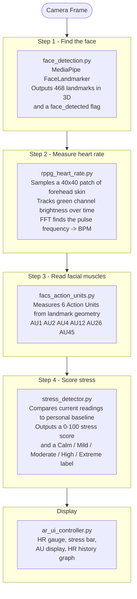
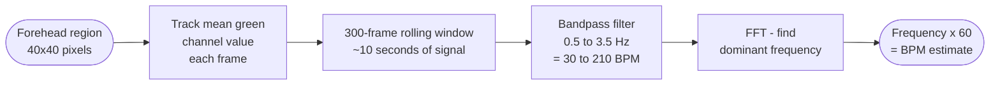
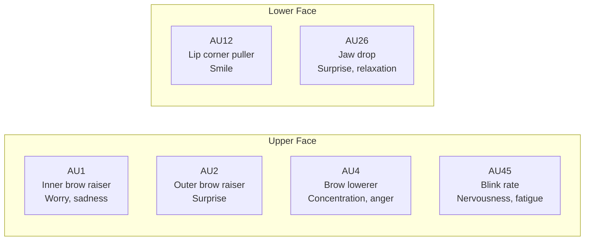
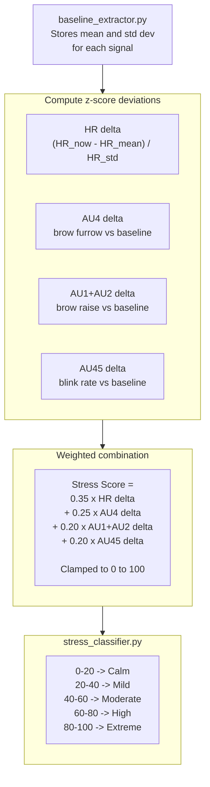
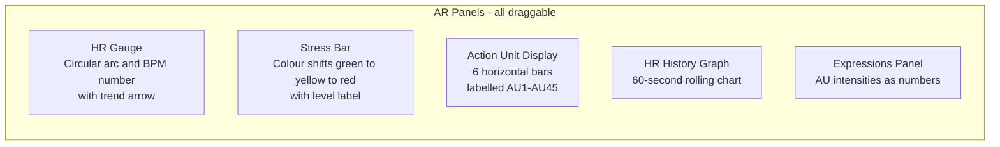

# micro_expressions - Physiological Signal Extraction and AR UI

Reads a person's heart rate, stress level, and facial muscle activity from a standard webcam - no wearable device required. Combines these signals into a calibrated stress score and displays them as an AR overlay.

---

## How the Pipeline Runs

Each camera frame flows through four modules in sequence. Each module reads from and writes to a shared `engine.shared_state` dictionary so any module can see any other module's output.



---

## How Heart Rate is Measured Without a Sensor

The skin over a blood vessel changes colour very slightly with each heartbeat - too subtle for the eye but detectable in video. This technique is called **remote photoplethysmography (rPPG)**.



Accuracy is best under natural or LED lighting. Fluorescent tubes flicker at mains frequency and can create artefacts in the signal.

---

## The Six Action Units

Action Units (AUs) come from the Facial Action Coding System - a standardised way to describe facial expressions in terms of individual muscle movements rather than labels like "angry" or "surprised".



Each AU is computed geometrically from landmark distances, so no pre-trained AU classifier is needed.

---

## How the Stress Score is Calculated

The score is a weighted sum of deviations from the player's **personal baseline** - not from population averages. A person with a naturally fast blink rate is not flagged as stressed just because they blink often.



### Baseline Calibration

When the system first sees a new person it runs a 30-second calibration window (a progress bar appears on screen). During this window it records the resting values for HR, stress score, and all six AUs. After calibration the stress score becomes meaningful for that individual.

Press `b` to force a new calibration at any time.

---

## What Is Displayed on Screen



Each panel has a small circle handle at its top centre. Point your index finger at it and hold 0.5 seconds to grab and drag it. Positions are saved automatically.

---

## Module Reference

| File | What it does |
|------|-------------|
| `engine.py` | Coordinates the pipeline. Modules register here and run in order each frame. |
| `face_detection.py` | MediaPipe FaceLandmarker - finds face, outputs 468 3D landmarks. |
| `rppg_heart_rate.py` | rPPG heart rate estimation from forehead skin colour. |
| `facs_action_units.py` | Geometric AU detection from landmark distances. |
| `stress_detector.py` | Baseline calibration, z-score deviation, 0-100 stress score. |
| `stress_classifier.py` | Converts numeric score to Calm/Mild/Moderate/High/Extreme. Detects spikes. |
| `ar_ui_controller.py` | Draws all AR panels on the live video frame. Handles drag state. |
| `hand_gesture_detector.py` | Gesture detector used in standalone mode. |
| `video_processor.py` | Run the same pipeline on a pre-recorded video file, export CSV. |
| `heart_rate_validator.py` | Compare rPPG readings to a manually entered reference value. |
| `stress_analytics.py` | Offline charts (timeline, distribution) from exported CSV data. |
| `main.py` | Standalone entry point - runs face analysis without poker integration. |

---

## Standalone Usage

```bash
python micro_expressions/main.py
```

| Key | Action |
|-----|--------|
| `q` | Quit |
| `b` | Force new baseline calibration |
| `v` | Start heart rate validation recording |
| `s` | Stop recording and print correlation result |
| Any number | Add a manual BPM reference reading for validation |

---

## Technical Notes

- rPPG requires a reasonably still subject. Heavy movement blurs the skin-colour signal.
- The stress score is **relative** - it only becomes meaningful after the calibration window completes.
- AU detection is approximate (geometry-based, not model-based). Clear expressions are detected reliably. Subtle micro-expressions are less consistent.
- `face_landmarker.task` and `hand_landmarker.task` must be present in this directory for standalone use.
