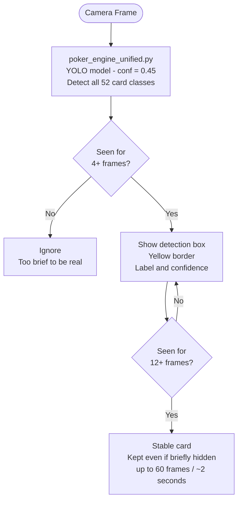
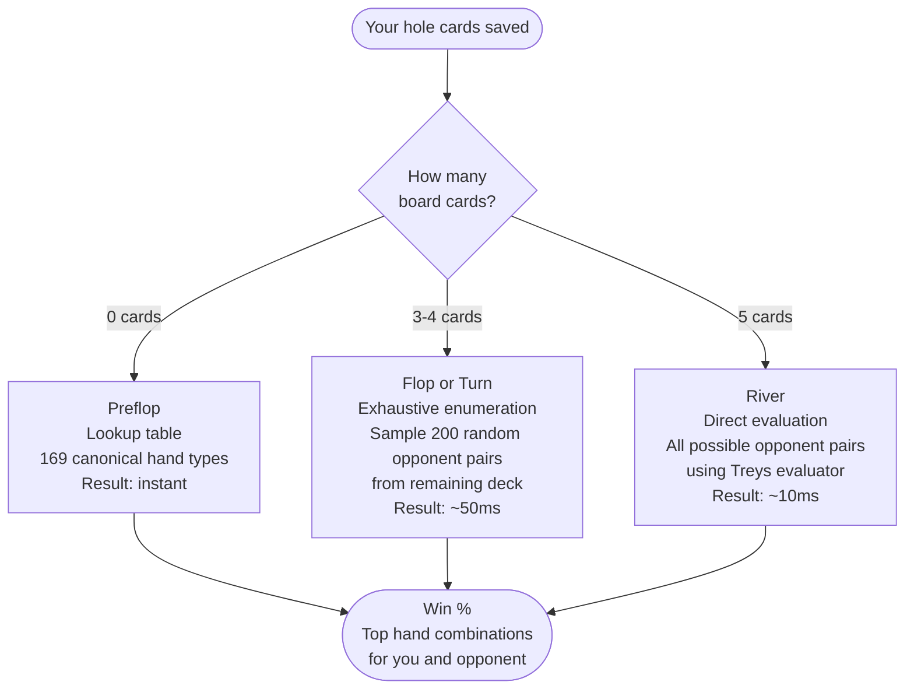
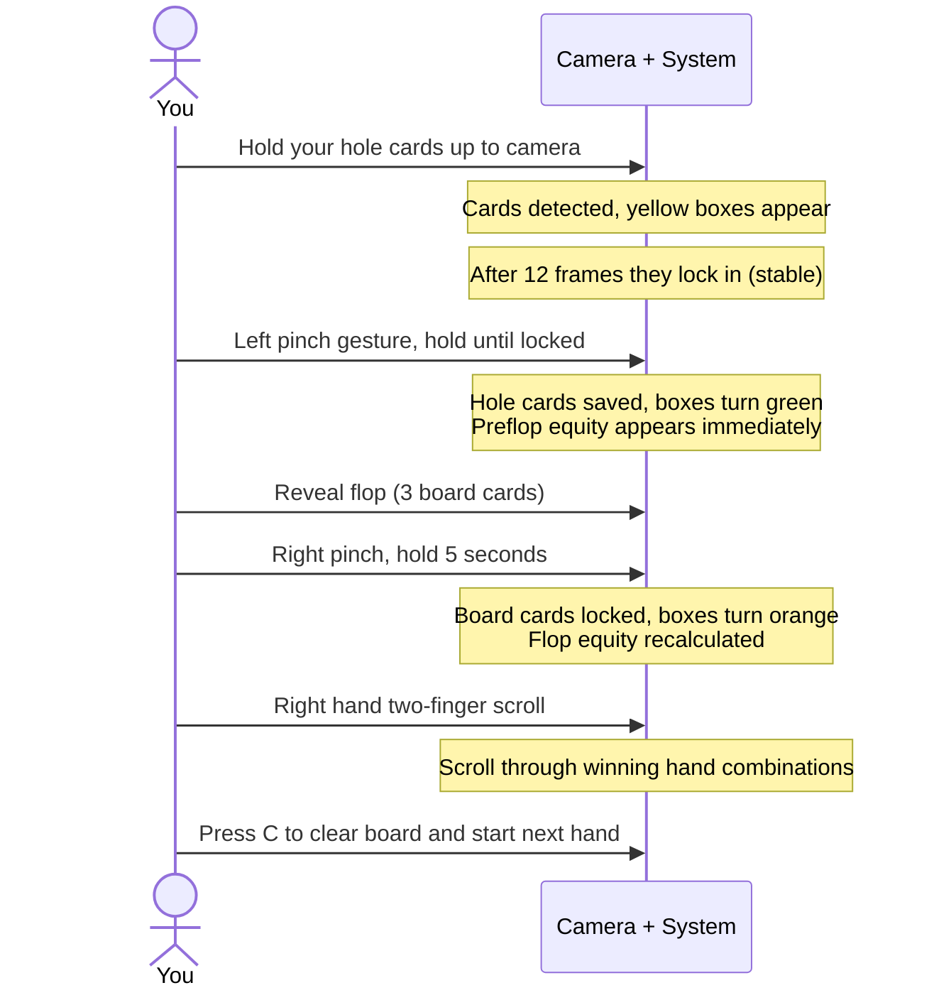
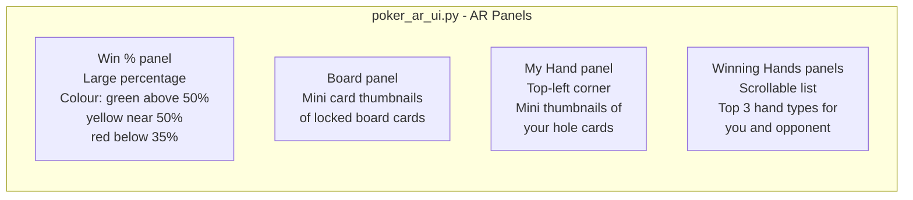

# poker_hand - Card Detection, Equity Calculation, and AR UI

Points a webcam at playing cards and identifies them using a custom-trained AI model. Once your hole cards are saved, it calculates your probability of winning against a random opponent and displays the result as an augmented reality overlay.

---

## How Cards Are Detected

A YOLO object detection model (`poker_v1.pt`) was trained on 24,000 images of all 52 standard playing cards. It runs on every other camera frame for performance.

Raw detections are noisy. A card might flicker in and out for a frame or two. A stability buffer filters this out:



**Card border colours on screen:**

| Colour | Meaning |
|--------|---------|
| Yellow | Detected, not yet saved |
| Green | Saved as your hole cards |
| Orange | Locked as a board card |

---

## How Equity Is Calculated

Once you save your hole cards, the system continuously calculates your probability of winning against a random opponent hand. The method depends on how many board cards are known:



The output includes win equity as a percentage plus the top 3 winning hand types for both you and a random opponent, shown in scrollable panels on the right side of the screen.

---

## How to Use It (Step by Step)



---

## What Appears on Screen



All panels are draggable. Point your index finger at the circle handle at the top of a panel and hold for 0.5 seconds to grab it.

---

## Gestures in Cards Mode

| Gesture | Action |
|---------|--------|
| Left pinch, hold until locked | Save visible cards as your hole cards |
| Right pinch, hold 5 seconds | Lock visible cards as board cards |
| Two-finger scroll (right hand, vertical) | Scroll winning hand combination panels |
| `c` key | Clear board and saved hand |

---

## Module Reference

| File | What it does |
|------|-------------|
| `poker_main.py` | Standalone entry point. Also contains the equity calculation functions (`calculate_equity_fast`, `exhaustive_enumeration`, `evaluate_river`) imported by the unified system. |
| `poker_ar_ui.py` | Draws all poker AR panels on the live frame. Handles scroll interaction. |
| `poker_engine_unified.py` | YOLO model wrapper. Manages card stability buffering and finalization. |
| `hand_gesture_detector.py` | Full gesture detector. Handles pinch, pinch-lock, two-finger scroll, thumbs, fist, and pointing. |
| `simple_card_detector.py` | Minimal standalone card detector for testing the YOLO model. |
| `preflop_equity.csv` | Win percentage lookup table for all 169 canonical starting hands. |
| `df_preflop_hand_distrib.csv` | Extended preflop distribution data. |
| `poker_v1.pt` | Custom-trained YOLOv8 model. 52 card classes. |

---

## Standalone Usage

```bash
python poker_hand/poker_main.py
```

| Key | Action |
|-----|--------|
| `q` | Quit |
| `c` | Clear board and saved hand |

---

## Technical Notes

- Cards work best when held flat, well-lit, and not overlapping each other.
- Glare on glossy card surfaces reduces detection confidence. Matte-finish cards perform better.
- The model handles standard poker card designs. Non-standard decks may not detect reliably.
- Equity calculation assumes heads-up (2 players). Multi-way pot equity is not computed.
- `face_landmarker.task` is present in this folder so `poker_main.py` can run standalone without needing the root directory on the path.
